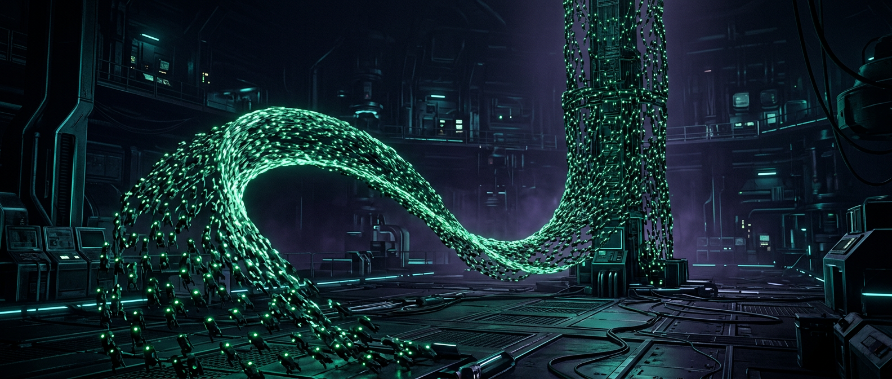

# Firebroxn — MICROBOTS



An interactive **microbot swarm** — a fan-made homage to *Big Hero 6*. Thousands of tiny
magnetic robots stream across the screen, link together with a glowing connection lattice,
and assemble into towers, waves, spiral galaxies, rain, the San Fransokyo skyline, a heart,
the Baymax face, and scrolling title phrases — all steered by your cursor like Hiro's
neurotransmitter headband.

**Zero dependencies.** Vanilla HTML/CSS/JS (canvas + WebAudio). Boot sequence, ambient hum,
synth SFX, four color themes (including Baymax armor red), ghost trails, screenshot capture
— and an auto-demo with scripted surges so it shows off even before you touch it.

**Live demo:** deployed to GitHub Pages by CI (see *Deployments* on the repo).

## Run it

```bash
npm start          # tiny static server on :8000 (serves dist/ if built)
# or
python3 -m http.server 8000
# or just open index.html
```

## Controls

| Input          | Action                                                     |
| -------------- | ---------------------------------------------------------- |
| Move cursor    | Neural link — steer the swarm                              |
| Hold LMB       | Gather — charge the swarm into a spinning ball             |
| Release        | Surge — detonate a microbot shockwave                      |
| Hold RMB       | Repel field — push bots away                               |
| Mouse wheel    | Spread — expand / tighten the swarm                        |
| `1`–`9`        | Swarm · Tower · Wave · Galaxy · Rain · City · Baymax · Heart · Text |
| `9` (in text)  | Cycle phrases (`BIG HERO 6`, `BA-NA-NA`, `HELLO`, `I AM BAYMAX`)    |
| `Space`        | Instant pulse burst                                        |
| `T`            | Color theme — kabuki green / armor red / hero purple / cyan|
| `G`            | Ghost trails                                               |
| `P` / `R`      | Pause / scatter-reset                                      |
| `C` / `F`      | Capture PNG / fullscreen                                   |
| `H`            | Control manual overlay                                     |

Population slider (400–2,200 bots) + an adaptive governor that holds 60 FPS automatically.
New bots visibly fly in from off-screen; surplus bots peel away.

## How it works

- **Swarm engine** — every bot spring-steers toward a mode-specific target with damping;
  a spatial-hash grid gives neighbor queries: separation keeps bots bead-spaced and close
  pairs render as glowing "links" (the connective lattice from the film).
- **Shape modes** — Baymax / heart / skyline / text are drawn to an offscreen canvas and
  pixel-sampled into target points the swarm settles into. The San Fransokyo skyline
  (buildings, sun disc, suspension bridge) is generated procedurally.
- **Audio** — synthesized chirps, whooshes, and an optional two-oscillator ambient hum via
  WebAudio. No audio assets.

## Build & deploy

```bash
npm run build      # stamps version/commit/date, cache-busts assets → dist/
```

CI (`.github/workflows/deploy.yml`) builds on every push and deploys `dist/` to
**GitHub Pages** via `actions/deploy-pages`. `build-info.json` and the build meta tags in
`index.html` record exactly which commit is live.

## Files

```
index.html            page + HUD + boot/help overlays
css/style.css         sci-fi lab HUD styling
js/microbots.js       swarm engine, 9 modes, themes, rendering, audio
scripts/build.js      dependency-free build → dist/
scripts/serve.js      tiny static dev server
.github/workflows/    CI: build → GitHub Pages
assets/banner.png     README art
```

---

Fan-made demo for fun. Not affiliated with Disney or Marvel. *"Tadashi is here."* 🩹
