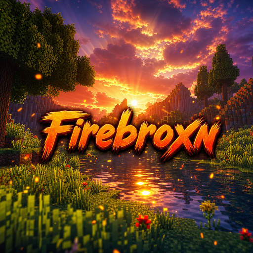

# Firebroxn — Minecraft Shaderpack

> **Warm Cinematic · Volumetric Light · Soft Shadows · Reflective Water**



**Firebroxn** is a custom Minecraft shaderpack built for **OptiFine HD U I5+** and **Iris Shaders** (1.16.5 → 1.21.x).  
It transforms vanilla Minecraft with a warm, fiery cinematic look — golden-hour sunsets, soft penumbra shadows, screen-space god rays, and water that actually *reflects* the sky — while staying lightweight enough for mid-range GPUs.

---

## ✨ Features

### 🌅 Sky & Atmosphere
- **Procedural sky model** — dynamic gradient from horizon to zenith, with sunset-shifted orange/magenta
- **Sun & Moon halo** — Mie scattering around the sun, soft glow around the moon
- **Stars + Milky Way** — hash-based star field that twinkles per-frame, fades near sun/horizon
- **Volumetric clouds** — drifting, sunset-lit billowed clouds with height fog
- **Distance & height fog** — exponential atmospheric perspective, denser in valleys and during rain, tinted with sunset colors at the horizon

### ☀️ Lighting & Shadows
- **Soft PCF shadows** — 12-tap Poission disk, variable penumbra by distance, 2048×2048 shadow map with distortion
- **Translucent shadows** — stained glass, water and foliage tint shadows via `shadowcolor0`
- **Subsurface scattering** — leaves glow when back-lit (wrap lighting)
- **Torch flicker** — block light gently pulses (sin-based)
- **Rain-softened shadows** — shadows fade 35% in rain, overall scene desaturates subtly
- **Sky / Block light** — full deferred lightmap handling in composite (2.2 gamma corrected)

### 💧 Water
- **Gerstner-style wave normals** — 3-layer wave field, distance-faded, animated via `frameTimeCounter`
- **Fresnel reflections** — Schlick fresnel (F0 0.02) mixed with planar sky reflection + **one-bounce SSR** (screen-space raymarch, edge & distance faded)
- **Sun specular** on water (256 pow) + horizon-biased sky reflection
- **Depth-based absorption** — shallow `0.22,0.55,0.68` → deep `0.06,0.18,0.42`, lit terminator warm tint
- **Underwater fog & caustics** — FBM caustics wobble, exponential fog (0.045 density), murky blue tint when `isEyeInWater==1`
- **Waving top surface** — vertex displacement for water tops (+ lateral chop)

### 🌿 World & Motion
- **Waving foliage & crops** — grass/crops sway at tops only (midTexCoord-tested), leaves flutter softly, wind strength `0.5 + sin(time)*` + rain boost
- **Shadow-matched waving** — `shadow.vsh` replays the same offsets so shadows wave with the geometry (no sliding)
- **Wetness** — `wetness * skyLight` lowers roughness for specular highlights on rainy surfaces, darkens albedo 12%

### 🔦 Post-Processing
- **2-pass bloom** — threshold 1.15 HDR extract → horizontal 9-tap → vertical 9-tap → additive (`BLOOM_STRENGTH 0.55`)
- **God rays (light shafts)** — 12-sample screen-space march from pixel to sunScreenPos, depth-sky masked, decay 0.97, exposure scaled by `sunVis*(1-rain)`
- **ACES Filmic Tonemapping** — Narkowicz approximation × 1.15 exposure, warm highlight push (`1.04,1.00,0.92`), slight contrast curve + `toSRGB`
- **Vignette** (`pow(1-dot*0.18,1.35)`), **film grain** (`interleavedGradientNoise` + bayer dither), subtle shadow lift

---

## 📦 What's Inside

```
Firebroxn/
├─ pack.png                 # Thumbnail (also in shaders/pack.png for OptiFine)
├─ shaders/
│  ├─ shaders.properties    # Shadow map 2048, buffers, screen routing & toggles
│  ├─ lib/
│  │  ├─ common.glsl        # Constants, palette, noise, hash, tonemap, fog
│  │  ├─ sky.glsl           # Procedural sky, stars, milky way
│  │  ├─ shadow.glsl        # PCF filtering, shadow color
│  │  ├─ water.glsl         # Wave normals, Fresnel, water color
│  │  └─ lighting.glsl      # Diffuse/ambient/specular
│  ├─ gbuffers_*.vsh/.fsh    # Terrain, water, skybasic, skytextured, clouds, entities, hand, weather, block, etc.
│  ├─ shadow.vsh/.fsh       # Shadow map with distortion + waving
│  ├─ composite.fsh         # Main deferred lighting — shadows, fog, water, godrays
│  ├─ composite1.fsh        # Bloom horizontal blur
│  ├─ composite2.fsh        # Bloom vertical + combine
│  ├─ final.fsh             # Tonemap, vignette, grain
│  ├─ lang/en_US.lang       # Shader options UI names
│  ├─ block.properties      # Waving blocks table
│  └─ pack.png
```

**Programs wired in `shaders.properties`:**
- `shadow` → `composite` → `composite1` → `composite2` → `final`
- `gbuffers_*` feed albedo / normal / lightmap / depth to composite

All GLSL is `#version 120` (OptiFine/Iris legacy compat).

---

## ⚡ Performance

| Preset | Shadow | God Rays | Reflections | Bloom | Target |
|--------|--------|----------|-------------|-------|--------|
| **Low** (edit properties: set 1024, disable) | 1024 | ✕ | ✕ | ✕ | 60+ FPS on GTX 1650 / iGPU |
| **Medium – Default** (as shipped) | 2048 | 12 spp | SSR 1 bounce | 9-tap ×2 | 45-60 FPS on RTX 2060 / RX 6600 |
| **High** | 3072 | 16 spp | 2 bounce | high | 30-45 FPS on RTX 3060+ |
| **Ultra** | 4096 | 24 spp | 2 bounce+refract | ultra+lens dirt | Enthusiast |

Ingame: **Options → Video Settings → Shaders → Shader Options** toggles:

- `Soft Shadows`, `Volumetric God Rays`, `Waving Foliage & Water`, `Water Reflections`, `Bloom Glow`

Disable for +20-40% FPS.

---

## 🎮 Installation

### OptiFine
1. Install **OptiFine HD U I5** (or newer) for your MC version — <https://optifine.net>
2. Copy the **folder** `Firebroxn` **or** the zip `Firebroxn.zip` into `/.minecraft/shaderpacks/`  
   (Windows: `%appdata%\.minecraft\shaderpacks\`, Linux/macOS: `~/.minecraft/shaderpacks/`)
3. Launch Minecraft → **Options → Video Settings → Shaders** → select **Firebroxn**
4. Click **Shader Options** to tweak toggles if needed, **Done**

### Iris + Sodium (Fabric)
1. Install Fabric Loader + **Sodium** + **Iris Shaders** + **Lithium** (optional) — <https://irisshaders.net>
2. Same copy step into `shaderpacks`
3. **Options → Video Settings → Shader Packs** → select **Firebroxn**

> **No restart needed** — you can switch in-game, but first load may compile ~10 secs (black screen = normal).

### Building a Zip
```bash
# From repo root:
cd Firebroxn
zip -r ../Firebroxn.zip shaders pack.png shaders.properties block.properties
# Or zip the folder itself:
cd ..
zip -r Firebroxn.zip Firebroxn -x "Firebroxn/.git/*"
```

---

## 🎨 Customization

- **Warmer / cooler:** edit `FIREBROXN_SKY_SUNSET`, `FIREBROXN_SUN_COLOR`, `BLOOM_STRENGTH` in `lib/common.glsl`
- **Fog density:** `fogDensity = 0.0012 * (1.0 + rainStrength*1.2)` in `composite.fsh` line ~340
- **Shadow softness:** change `SHADOW_SAMPLES 12` in `lib/common.glsl`, radius `1.2 / shadowMapResolution` in `lib/shadow.glsl`
- **Water color:** `waterColorShallow / Deep` in `lib/water.glsl`
- **Tonemap exposure:** `acesTonemap(color * 1.15)` in `lib/common.glsl` → `firebroxnTonemap`

After edits, **reload shaders** with `F3+R` or Shaders → select again.

---

## 🧪 Compatibility

- **MC:** 1.16.5, 1.17.1, 1.18.2, 1.19.x, 1.20.x, 1.21.x (legacy GLSL 120 is stable across)
- **Loaders:** OptiFine / Iris+ Sodium. **Not** compatible with vanilla, Canvas, SEUS PTGI path-tracing labPBR branch (labPBR not implemented).
- **Resources:** Works with vanilla, Faithful 32x, Compliance. labPBR specular/normal maps partially respected (fallback to vertex normal if missing).
- **Dimensions:** Overworld cinematic sun, Nether/End fallback to lower shadowRes 1024 + fog tint.

---

## 📸 Credits & License

- Author: **Firebroxn Team** / `alrickdaley8` — built on Arena.ai Agent Mode
- Base techniques: OptiFine shader docs, Iris template, classic ACES / PCF / Fresnel via public domain GLSL snippets
- Thumbnail: AI-generated (included `shaders/pack.png`) — free for pack distribution
- **License:** MIT — free to use, remix, share; attribution appreciated. Not for commercial resale as “new” shaderpack without changes.

> *Crafted with 🔥 — “Make it warm, make it wavy, make it Firebroxn.”*

---

## ❓ Troubleshooting

| Issue | Fix |
|-------|-----|
| **Black screen on first select** | Wait 5-15s (shader compilation). If persists, check `.minecraft/logs/latest.log` for `GLSL compile error` → ensure OptiFine/Iris updated |
| **Pink water / white terrain** | Normal map missing? We fallback to vertex normal; update GPU drivers, disable `Fabulous` graphics → set `Fancy` |
| **Flickering shadows** | Increase `shadowDistance` or `shadowIntervalSize` in `shaders.properties`, lower `shadowMapResolution` to 1024 |
| **Low FPS** | Disable Bloom / God Rays / Waving in Shader Options, lower render distance 12→8, turn off Smooth Lighting shadow? |
| **Clouds not moving** | Check `gbuffers_clouds.vsh` — `frameTimeCounter * 0.035` drift. If static, ensure `animation` not frozen via resource pack |
| **Zip not detected** | Ensure zip contains `shaders/` at root, not `Firebroxn/shaders/`. Re-zip from inside folder if needed |

Enjoy — and send screenshots! 🌅🔥
